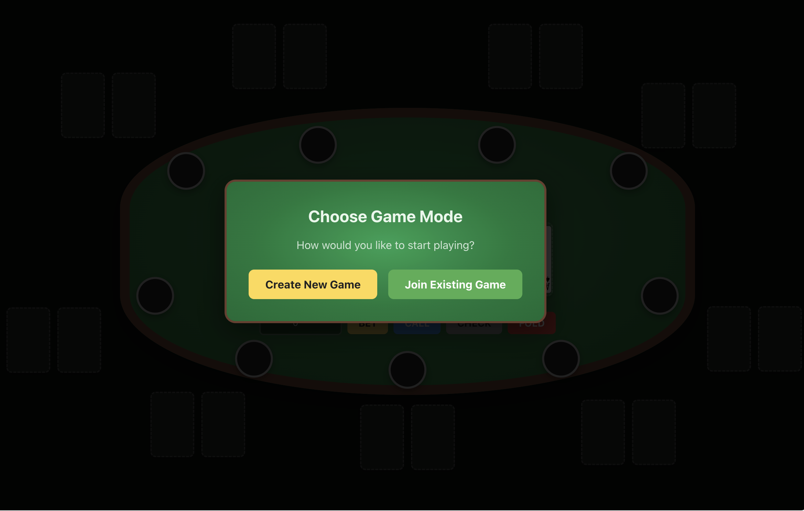
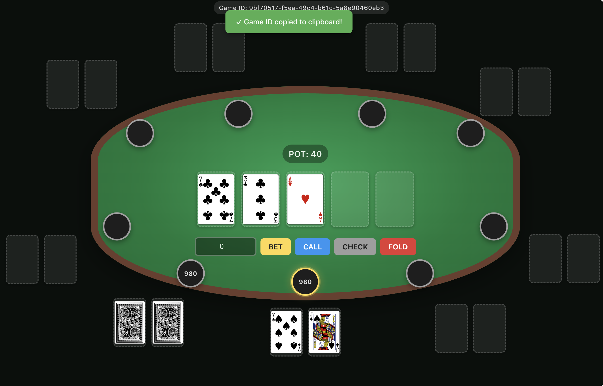

# quick-poker-try

A simple Texas Poker game on web page. Develop it for node.js learning.





The project consists of an Express-based Node.js backend game engine and a Vite + Vue frontend.

## Development

Install dependencies first in both folders:

- In `game-page`: `npm install`
- In `game-engine`: `npm install`

Run the frontend (under `game-page/`):

```
npm run dev
```

Run the backend (under `game-engine/`):

```
node app.js
```

## What should you expect from this project

This project came together mainly because an AI generated a poker table UI I really liked, which pushed me to use it and, along the way, practice building a small Node.js project. Please don’t expect insights about performance or deep game design here.

That said, two things might still be helpful:

- **UI and styling**: The game page creates a nice poker-table atmosphere. If you’re building a poker game from scratch, these pages and styles may be reusable or at least inspirational.
- **Endpoints and state machine**: Fully implementing a Texas Hold’em round required more endpoints than I first estimated—even for what I consider an MVP. See `game-engine/service/game.js` for the implemented methods and state-machine transitions. If you’re missing some of these methods, you probably can’t deliver a complete Hold’em round.
